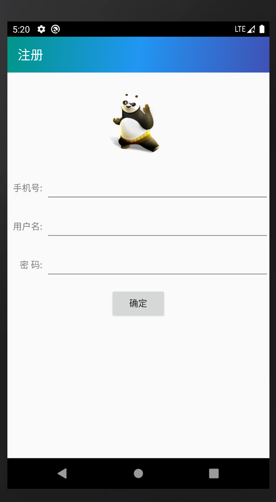
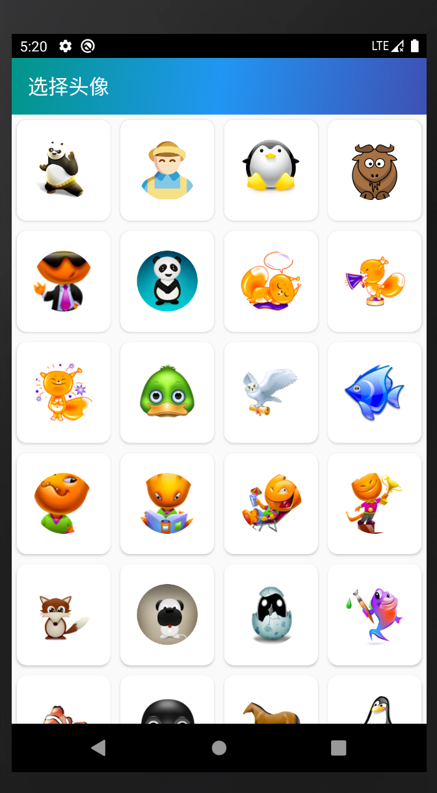
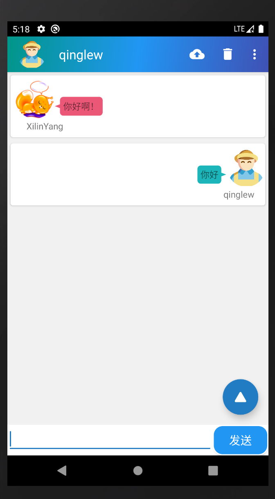
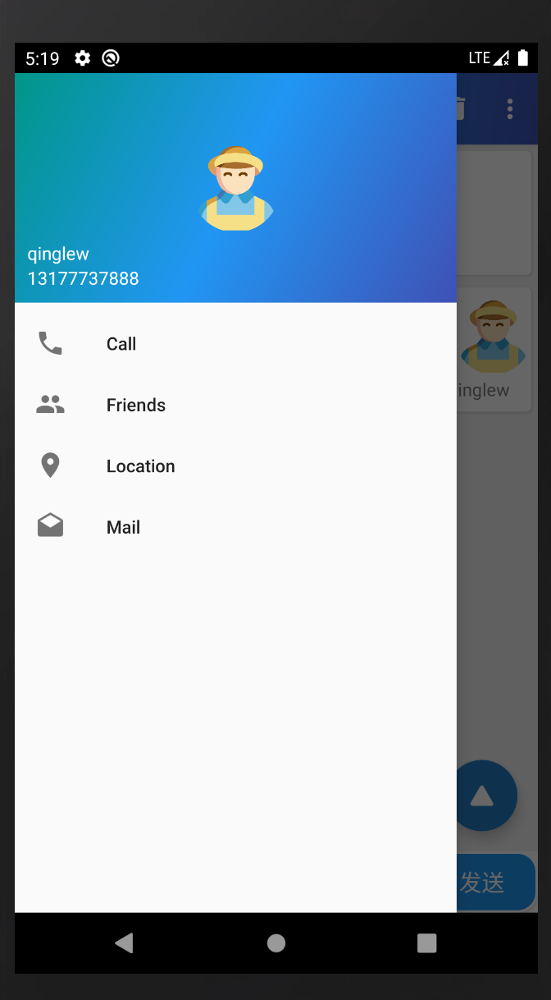

# OnlineChatting

This is a application for online chatting based Android. And it is the final exam of the course Android Application Development of NCU in autumn term in 2019-2020. This is only the Android client of the project. As for the server and the PC client, please click [here](https://github.com/qinglew/OnlineChatter).

### Screenshots

**Login**

**Register**

**Select A Icon**

**Multiple User Chatting**

**Navigation View**

