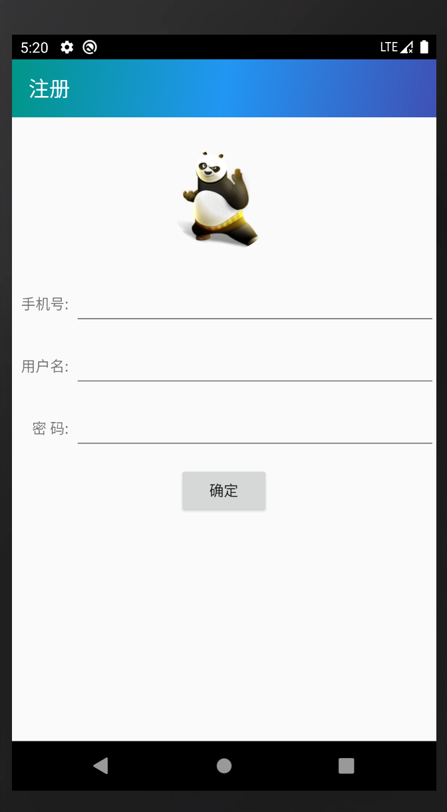
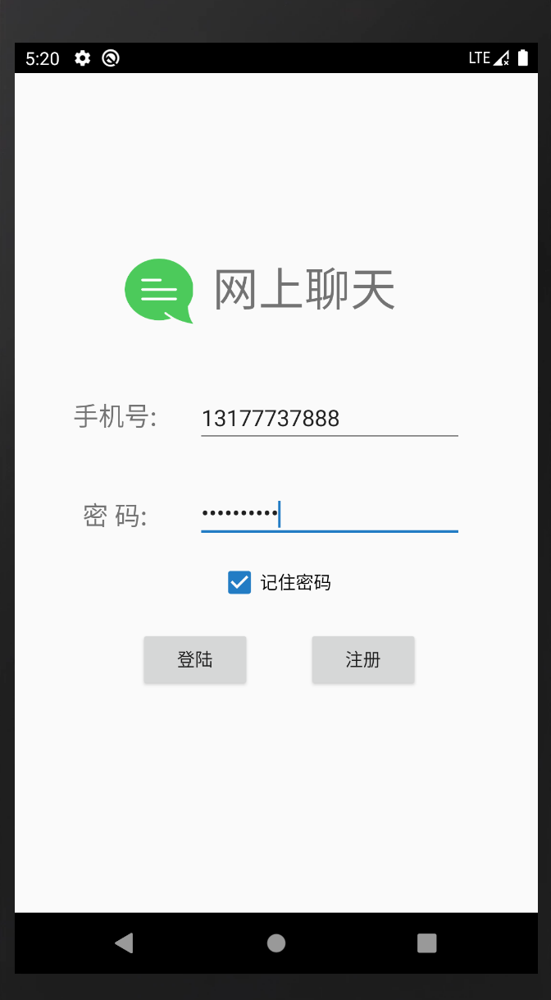
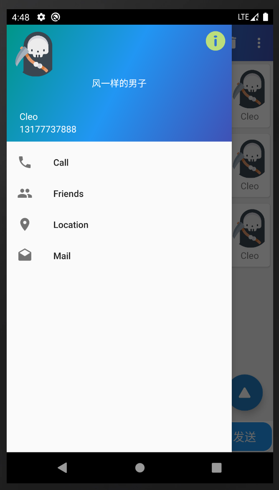
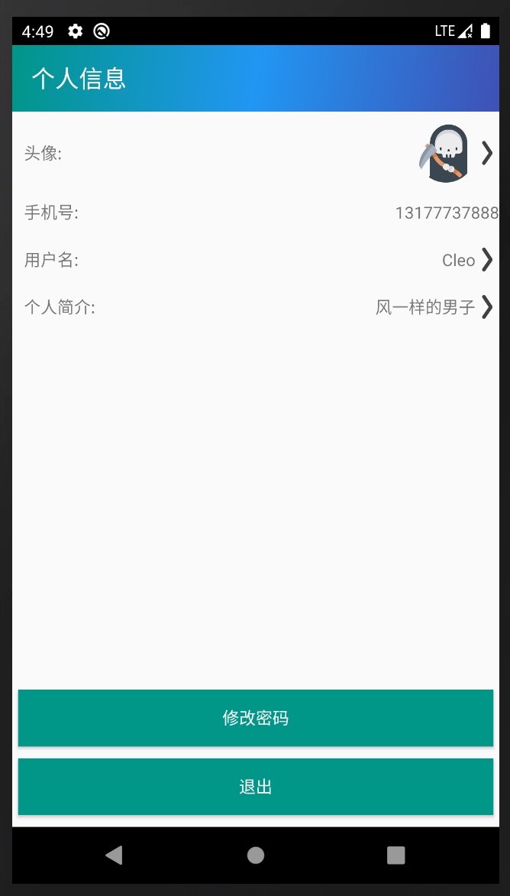
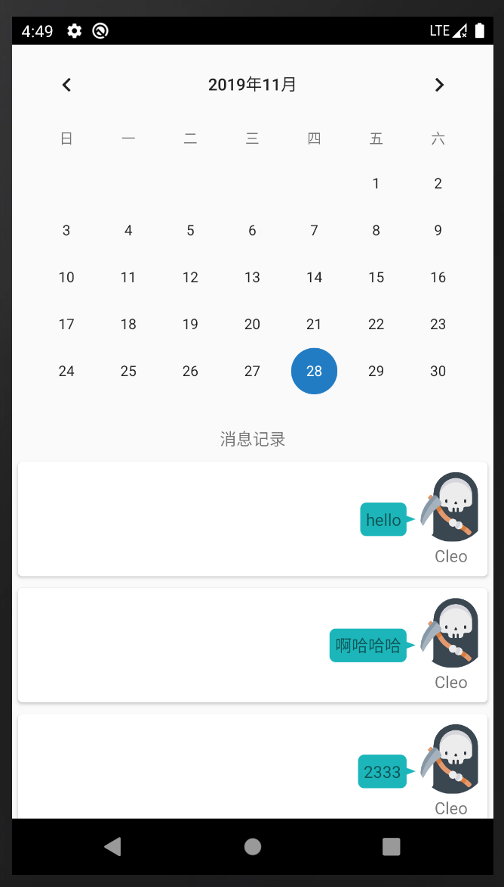

# OnlineChatting

### Introduction

This is a application for online chatting based Android. And it is the final exam of the course Android Application Development of NCU in autumn term in 2019-2020. This is only the Android client of the project. As for the server and the PC client, please click [here](https://github.com/qinglew/OnlineChatter).

### Functions

* Register 注册
* Login 登陆
* Chatting 多人聊天
* Modify User's Info 修改用户信息(图片、用户名、密码等)
* Online Users' List 在线用户列表
* User's info查看用户信息
* Manage Message History 按日期管理消息记录

### Technology Stack

* Material Design
* Glide
* Litpal

### Screenshots

**Register**

**Login**

**Multiple User Chatting**

**Navigation View**

**Personal Information**

**Message Management**

